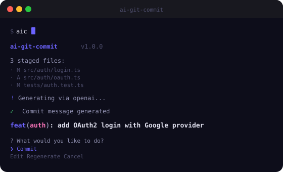

<div align="center">

# ai-git-commit


<br/>

[](https://github.com/MhmmdFaizal04/ai-git-commit/stargazers)
[](https://npmjs.com/package/ai-git-commit)
[](LICENSE)
[](tsconfig.json)
[](CONTRIBUTING.md)

<br/>

> **Stop writing commit messages manually.**  
> Stage your changes, run `aic`, and get a perfect [Conventional Commit](https://www.conventionalcommits.org/) in seconds — powered by OpenAI, Anthropic, or a local LLM via Ollama.

<br/>

[Live Demo](https://mhmmdfaizal04.github.io/ai-git-commit/examples/) &nbsp;&middot;&nbsp; [Install](#install) &nbsp;&middot;&nbsp; [Configuration](#configuration) &nbsp;&middot;&nbsp; [Providers](#providers)

</div>

---

## Preview

<div align="center">

</div>

---

## Install

```bash
# Global install — recommended
npm install -g ai-git-commit

# Or use without installing
npx ai-git-commit

# Aliases available after install
aic          # Short alias
ai-git-commit  # Full name
```

---

## Quick Start

```bash
# 1. Setup your AI provider (one-time)
aic setup

# 2. Stage your changes as usual
git add .

# 3. Generate + commit
aic
```

That's it. The AI reads your `git diff --staged`, picks the right commit type, and writes a clean message.

---

## How It Works

```
git add .          →  Staged diff
     ↓
aic                →  Reads diff + recent commits for style context
     ↓
AI Provider        →  Analyzes changes, picks type (feat/fix/docs/...)
     ↓
Generated message  →  feat(auth): add OAuth2 login with Google provider
     ↓
Confirm / Edit     →  You review, edit, or regenerate
     ↓
git commit         →  Done ✓
```

---

## Usage

```bash
# Basic — interactive confirm
aic

# Preview only — don't commit
aic --dry-run

# Auto-commit without prompt
aic --yes

# Override provider for this run
aic --provider ollama
aic --provider anthropic

# Use a specific model
aic --model gpt-4o
aic --model llama3.2

# Skip commit body
aic --no-body

# View current config
aic config

# List recommended models
aic models

# Re-run setup wizard
aic setup
```

---

## Configuration

Config is stored at `~/.aiccommit.json` (global) or `.aiccommit.json` in your project root (per-project).

```jsonc
{
  "provider": "openai",          // "openai" | "anthropic" | "ollama"
  "apiKey": "sk-...",            // or set OPENAI_API_KEY env var
  "model": "gpt-4o-mini",        // model name
  "ollamaUrl": "http://localhost:11434",  // Ollama server URL
  "maxDiffLength": 6000,         // truncate large diffs (saves tokens)
  "locale": "en",                // commit language: "en", "id", etc.
  "includeBody": false,          // include body explaining WHY
  "emojiStyle": "none"           // "none" | "gitmoji"
}
```

### Environment Variables

```bash
export OPENAI_API_KEY=sk-...          # OpenAI key
export ANTHROPIC_API_KEY=sk-ant-...   # Anthropic key
export AIC_PROVIDER=ollama            # Override provider
export AIC_MODEL=llama3.2             # Override model
```

---

## Providers

### OpenAI

```bash
aic setup  # choose OpenAI, enter API key
# or
export OPENAI_API_KEY=sk-...
aic
```

| Model | Speed | Cost | Quality |
|-------|-------|------|---------|
| `gpt-4o-mini` | Fast | ~$0.0001/commit | Great — **recommended** |
| `gpt-4o` | Medium | ~$0.001/commit | Best |
| `gpt-3.5-turbo` | Fast | ~$0.00005/commit | Good |

### Anthropic

```bash
export ANTHROPIC_API_KEY=sk-ant-...
aic --provider anthropic
```

| Model | Speed | Notes |
|-------|-------|-------|
| `claude-3-haiku-20240307` | Very fast | Cheap, great for commits |
| `claude-3-5-sonnet-20241022` | Medium | Best quality |

### Ollama (Local — Free)

Run completely offline. No API key, no cost, no data sent to the cloud.

```bash
# 1. Install Ollama
# https://ollama.com

# 2. Pull a model
ollama pull llama3.2

# 3. Use it
aic --provider ollama
```

| Model | Notes |
|-------|-------|
| `llama3.2` | Recommended — good balance |
| `deepseek-coder-v2` | Excellent for code |
| `qwen2.5-coder` | Strong coder |
| `mistral` | Fast and capable |
| `codellama` | Code specialized |

---

## Commit Types

The AI automatically picks the correct type:

| Type | When used |
|------|-----------|
| `feat` | New feature or enhancement |
| `fix` | Bug fix |
| `docs` | Documentation changes |
| `style` | Formatting, whitespace, no logic |
| `refactor` | Code restructure without fix or feat |
| `test` | Add or update tests |
| `chore` | Maintenance, deps, config |
| `perf` | Performance improvement |
| `ci` | CI/CD configuration |
| `build` | Build system changes |
| `revert` | Revert a previous commit |

### Examples

```
feat(auth): add OAuth2 login with Google provider
fix(api): handle null response from payment gateway
docs: update README with Ollama setup instructions
refactor(db): extract query builder to separate module
perf(images): lazy load below-fold images with IntersectionObserver
test(cart): add unit tests for discount calculation logic
chore: update dependencies to latest stable versions
```

---

## Per-project Config

Add a `.aiccommit.json` to your project root to override global settings:

```jsonc
// .aiccommit.json — project-specific
{
  "model": "gpt-4o",
  "includeBody": true,
  "locale": "en"
}
```

Add to `.gitignore` if it contains your API key. Use env vars instead for security.

---

## Contributing

```bash
git clone https://github.com/MhmmdFaizal04/ai-git-commit.git
cd ai-git-commit
npm install
npm run dev  # tsx watch mode
```

Areas for contribution:
- New AI provider integrations (Gemini, Groq, Mistral API)
- Git hooks integration (`prepare-commit-msg`)
- VS Code extension
- Additional languages/locale support

---

## License

[MIT](LICENSE) — free for personal and commercial use.

---

<div align="center">

If this saves you time every day, a star means a lot.

[](https://github.com/MhmmdFaizal04)

Made by [MhmmdFaizal04](https://github.com/MhmmdFaizal04)

</div>
